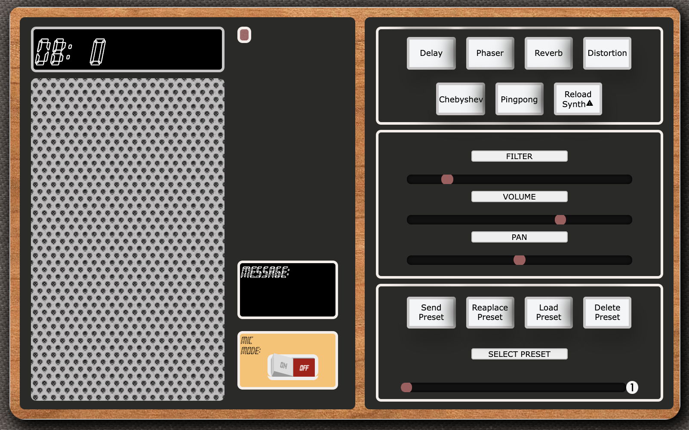
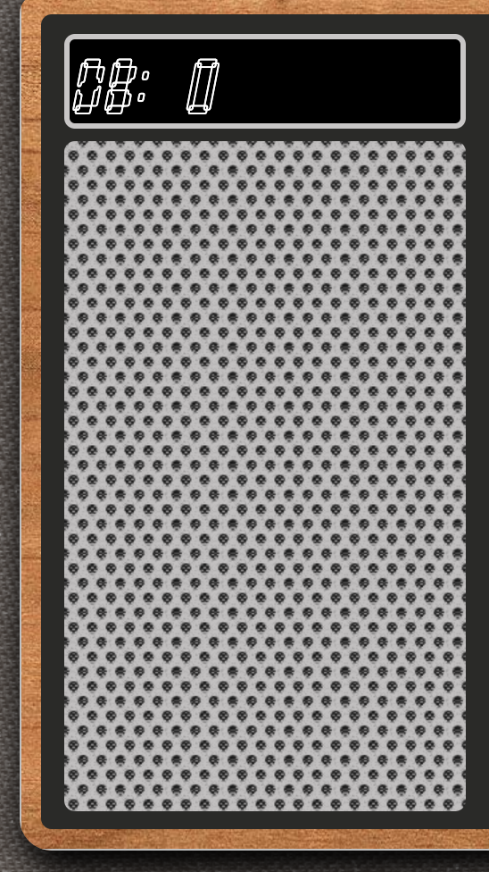
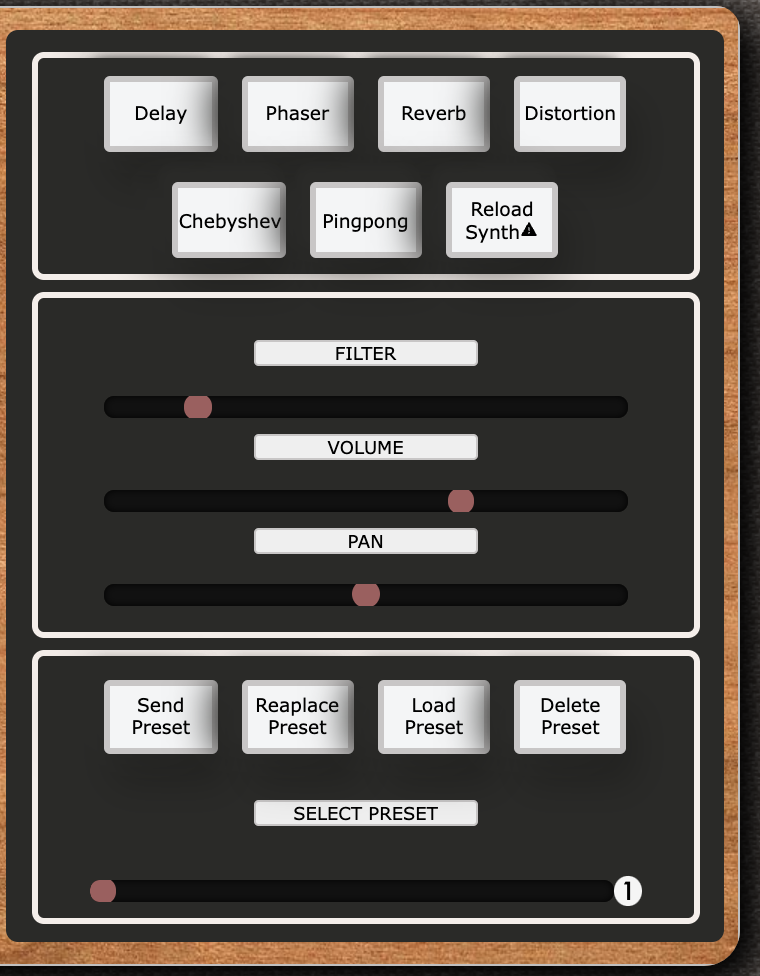
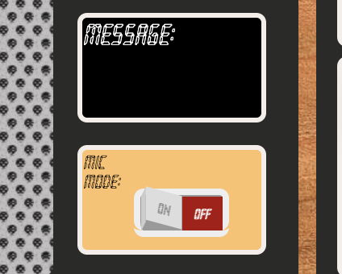

# Amp&Play - Stylophone Amplificator.

# What is Amp&Play?

Amp&Play is a [stylophone](https://en.wikipedia.org/wiki/Stylophone)-like synthetizer. With Amp&Play you will be able to generate cool sounds in real time only with your browser. For this project the frontend was developed using React JS and the backend using Node JS. In the Frontend the audio is manipulated using the [Audio Web api](https://developer.mozilla.org/en-US/docs/Web/API/Web_Audio_API) and the framework [Tone.js](https://tonejs.github.io/). In the backend, presets data is managed using Express and stored in MongoDB.

# Features

### Pad

A sine wave is produced when the grill pad is clicked or touched.

### Effects

6 cool effects can be applied to the oscillator signal.

### Sliders

The sliders change the volume, panning and filter. Also modifyng the signal from the oscillator.

### Presets

 

You can create up to 5 unique presets. Press the buttons and move the sliders. This section can only be accessed by Authentication through AuthO.

 

### Custom presets

Once you find a tone or sound you like you can save/replace/load/delete the presets in the database. Move the "select preset" slider to pick one of the five options.

### Mic Mode

 
Mic Mode pemits the browser to open your computer's microphone and use it as the source of the sound you want to modify. In this mode you have to choose the effect first and later click the ON/OFF switch at the bottom of the application. For the momment, only one effect at the time can be used.

# Technologies

- React
- [Auth0](https://auth0.com/)
- [Audio Web API](https://developer.mozilla.org/en-US/docs/Web/API/Web_Audio_API)
- [Tone.js](https://tonejs.github.io/)
- Node
